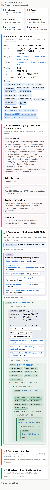

# 🥐 Croissant Viewer

A Chrome extension that renders an ML **[Croissant](https://mlcommons.org/croissant)** dataset file
in a **side panel** — color-coded by layer, with the embedded W3C **PROV-O** provenance drawn as a
readable top-down lineage and every identifier clickable (ORCID, DOI, UniProt, GitHub commit, UBERON).

Croissant files are JSON-LD, which browsers display as raw text. This makes them legible to a human.

  

Light theme shown — the panel also has a dark theme (toggle with the ◐ button).

## Features

- **Reads a Croissant three ways:** a web page that embeds one (verified on
  [Hugging Face](https://huggingface.co/datasets) and [OpenML](https://www.openml.org/) dataset
  pages), a raw `croissant.json`/`.jsonld` URL open in a tab, or a local file.
- **Six layers, color-coded** along a single gradient (Metadata → Resources → Structure →
  Responsible AI → Provenance → Semantic). A collapsible color key explains them, and any layer a
  given file doesn't contain is greyed out — so a metadata-only Croissant shows its shape at a glance.
- **Provenance as a lineage**, read top-down (dataset → activity → the chain it derives from),
  including embedded W3C PROV-O (used for e.g. HuBMAP donor → tissue → imaging → processing).
- **Tab-scoped panel:** it belongs to the tab you opened it on and closes when you switch tabs.
  Click 🥐 again to open it on another tab (Chrome only lets a side panel open from a click, so it
  can't auto-restore itself when you switch back).
- **Full-tab view** for large datasets (the ⤢ button, and where opened files render).
- Light + dark; a single transparent icon that works on both.

## Install (from source, unpacked)

1. Download or clone this repository.
2. Open `chrome://extensions` in Chrome (or Edge/Brave).
3. Turn on **Developer mode** (top-right).
4. Click **Load unpacked** and select the **`extension/`** folder in this repo.
5. Pin the 🥐 icon. Click it on a page to open the side panel.

If you're running it unpacked from a local clone, click the ↻ reload button on its card in
`chrome://extensions` after you `git pull` new changes, so Chrome re-reads the updated files.
(Store-installed copies update separately, when a new version is uploaded to the store.)

## Usage

Click the 🥐 toolbar icon on a page to open the panel and scan that page:

- **Embedded** — e.g. a [Hugging Face](https://huggingface.co/datasets/fka/awesome-chatgpt-prompts)
  or [OpenML](https://www.openml.org/) dataset page; click 🥐.
- **Raw URL** — open a `croissant.json` in Chrome (you'll see raw text), then click 🥐. There's no URL
  box in the viewer — the address bar already is one.
- **Local file** — "Open file…" in the panel opens the file in the full-tab view.

## Permissions & privacy

Permissions: `sidePanel`, `scripting`, `activeTab`, `storage`. **No broad host permission** —
`activeTab` means the extension only touches a page the moment you click 🥐. Everything renders
locally in your browser; **nothing is uploaded anywhere**.

## Notes & current limits

- **Kaggle** pages don't embed Croissant (only a plain schema.org Dataset for SEO); their Croissant is
  a separate download. Use its "Download Croissant" button, then "Open file…".
- **Double-clicking a local file to open it here** isn't automatic on macOS/Windows (Chrome's
  `file_handlers` manifest key is ChromeOS-only). A `file://` renderer is on the [roadmap](#roadmap).

## Roadmap

Rough ideas, not commitments — issues and suggestions welcome:

- **Kaggle support** — fetch a dataset's Croissant from Kaggle's download endpoint (it isn't embedded
  in the page).
- **Open a local file by double-click** — a `file://` renderer so double-clicking a `.jsonld` (with
  Chrome set as the default app and "Allow access to file URLs" enabled) opens it in the viewer.
- **Auto-render raw Croissant URLs** — optionally beautify a raw `.json`/`.jsonld` tab with no click.
- **Publish to the Chrome Web Store**, and Edge / Firefox ports.

## Contributing

Issues and pull requests welcome — see [CONTRIBUTING.md](CONTRIBUTING.md). The whole extension is
plain HTML/CSS/JavaScript with no build step or dependencies.

## Acknowledgments

Built at the [Pittsburgh Supercomputing Center](https://www.psc.edu/) / HuBMAP HIVE, originally to
inspect Croissant metadata for the HuBMAP → CFDE work. "Croissant" is a metadata format from
[MLCommons](https://mlcommons.org/croissant). The 🥐 icon is rendered from
[Noto Color Emoji](https://github.com/googlefonts/noto-emoji) (SIL Open Font License). Not an official
MLCommons project.

## License

[MIT](LICENSE) © 2026 Kasia Kedziora
